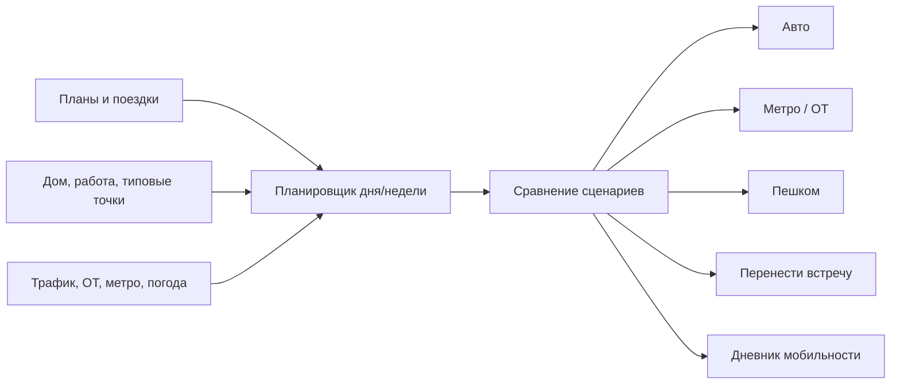

# TrafficSkip / SKIP THE TRAFFIC


**SKIP THE TRAFFIC** - концепт цифрового сервиса для городской мобильности. Идея проекта не в том, чтобы просто быстрее вести водителя по пробкам, а в том, чтобы помогать человеку выбирать более разумный способ передвижения: авто, метро, общественный транспорт, пеший маршрут или перенос поездки.

Репозиторий оформлен как продуктовый portfolio case: здесь собраны продуктовая идея, MVP-скоуп, пользовательские сценарии и юридические документы для B2C-сервиса на российском рынке.

## Проблема

Классические навигаторы отвечают на вопрос: **"как доехать прямо сейчас?"** Обычно они подразумевают, что пользователь уже выбрал автомобиль.

TrafficSkip решает более широкую задачу:

- снижать личные потери времени, денег и нервов на поездки;
- сравнивать разные режимы передвижения, а не только автомобильные маршруты;
- уменьшать лишние поездки на личном авто;
- помогать распределять поездки во времени и снижать пиковую нагрузку на городскую сеть.

## Продуктовая идея



## Ключевые сценарии

| Сценарий | Пользовательская ценность |
| --- | --- |
| Планировщик недели | Подсказывает, когда и каким способом ехать, чтобы не попадать в пиковую нагрузку |
| Сравнение авто/метро/ОТ | Показывает реальную стоимость поездки: время, деньги, стресс, риск пробок |
| Осознанное использование авто | Помогает группировать дела и выбирать автомобиль только там, где он действительно оправдан |
| Аналитика мобильности | Показывает, сколько времени, денег и поездок можно сэкономить изменением привычек |
| Legal/privacy pack | Демонстрирует готовность продукта к B2C-запуску: условия, приватность, данные геолокации |

## MVP

В учебный MVP заложены:

- онбординг с домом, работой, наличием автомобиля и отношением к метро/ОТ;
- экран "Моя неделя" с поездками и рекомендациями;
- карточка отдельной поездки с сравнением вариантов;
- простая аналитика времени, денег и доли поездок на авто;
- юридические документы под российский B2C-сценарий.

## Документы

| Файл | Назначение |
| --- | --- |
| [docs/product-vision.md](docs/product-vision.md) | Полное описание проблемы, позиционирования, сценариев и MVP |
| [docs/terms-of-use.md](docs/terms-of-use.md) | Пользовательское соглашение сервиса |
| [docs/privacy-policy.md](docs/privacy-policy.md) | Политика конфиденциальности по ФЗ-152 |
| [docs/legal-document-prompt.md](docs/legal-document-prompt.md) | Промпт/ТЗ для генерации legal-документов |
| [docs/README.md](docs/README.md) | Навигация по документации |

## Что показывает проект

- Product thinking: проблема сформулирована не как "сделать еще один навигатор", а как сервис рациональной городской мобильности.
- UX/MVP scope: описаны сценарии, экраны и границы первой версии.
- Smart City context: учтены индуцированный спрос, внешние эффекты и нагрузка на дорожную сеть.
- Privacy/legal awareness: явно разобраны геолокация, данные поездок, автомобильные данные, аналитика, реклама и партнерские интеграции.
- Prompt engineering: сохранено исходное ТЗ для подготовки юридических документов.

## Структура

```text
.
├── README.md
└── docs/
    ├── README.md
    ├── product-vision.md
    ├── terms-of-use.md
    ├── privacy-policy.md
    └── legal-document-prompt.md
```

## Статус

Это концепт и документационный MVP. Юридические тексты являются учебными шаблонами и требуют финальной проверки юристом перед реальным коммерческим использованием.
